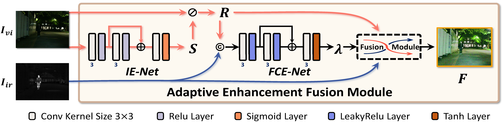

<p align="center">
<h1 align="center">  Efficient Feature Difference-Based Infrared and Visible Image Fusion for Low-Light Environments </h1>
</p>

💡 By  Duo Liu, Guoyin Zhang, Yiqi Shi, Ye Tian, Liguo Zhang


<p align="center">
    
</p>

<h4 align="center"> 🎖️ EFDFusion Framework
</h4>

Our contributions are summarized as follows:

🌟 We present a novel IVIF method, EFDFusion, for low-light conditions. Integrating LLIE with IVIF in one module to provide a bright and comprehensive scene in fused images.

🌟 A feature difference mechanism and a three-channel fusion coefficient map are proposed to address fused image distortion from introducing infrared information. 

🌟 Employing a weight-sharing cascaded pattern in multi-stage training, our method achieves low resource consumption and high efficiency in the testing phase.

<p align="center">
    
</p>

<h4 align="center"> 🎖️ The principle of feature difference mechanism.

## 🎯 Installation


### 💡 1. Requirements

* PyTorch 1.13.0
* CUDA 11.7
* Torchvision 0.14.1


### 🔥 2. Testing
<p align="center">
    
</p>

Our code requires `Python>=3.8`
```bash
python test.py
```


